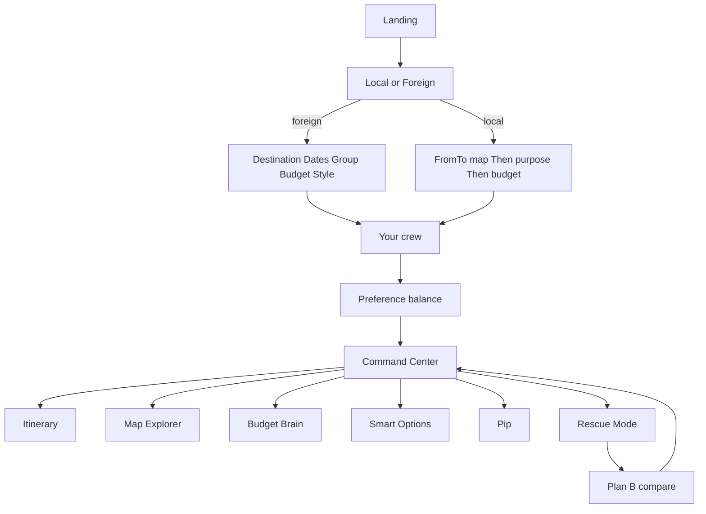
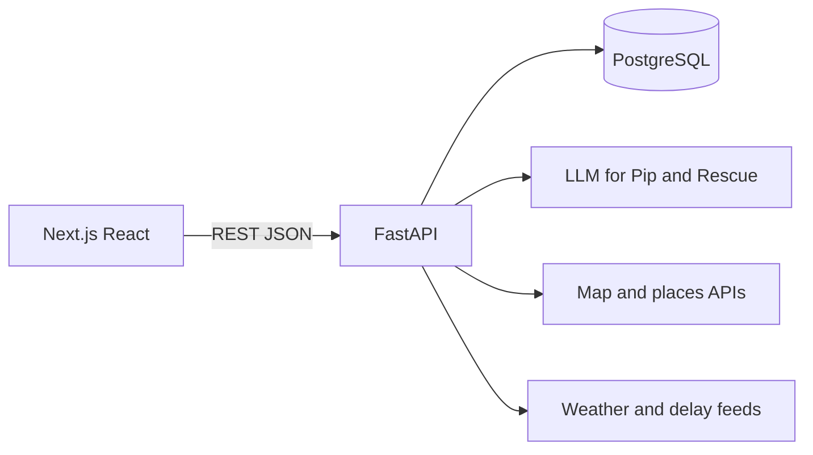

# EscapeSync by Code Benders

**Team:** Code Benders  
**Track:** Lifestyle — Planning an Escape

---

**Problem:** Trip planning is scattered across five apps and a group chat. When rain, delays, or budget cuts hit, existing platforms leave travellers stranded—they organize bookings, but they don't rebuild broken plans.

**Solution:** EscapeSync is a group travel operating system with **Rescue Mode** (auto-generates Plan B), a **crew fairness engine** (balances everyone's interests), **Local vs Foreign** trip paths (same-city hops or overnight destinations), and **Pip** (an AI assistant that watches the day and helps you replan).

**Unique:** The only platform that treats replanning, group fairness, and budget as first-class features—not afterthoughts.

**Tech:** Next.js + React (web-first PWA), FastAPI + PostgreSQL backend, Leaflet maps, LLM for Pip and Rescue.

---

## Target Users

**Primary:** Groups of 2–6 travellers (couples, friend groups, families) planning multi-day trips or same-city outings where budget, schedules, and preferences need to align.

**Why them:**
- **Couples** plan date nights or weekend getaways but don't want to juggle separate budget trackers and itinerary apps.
- **Friend groups** struggle to balance varying budgets, walking tolerance, and interests (e.g., Alice loves food, Chris prefers culture). EscapeSync's crew fairness engine surfaces under-representation before the trip starts.
- **Families** with kids or elderly members need accessibility-aware routing (walking tolerance, pace) and replanning when weather or health disrupts the day.

**Secondary:** Solo travellers who want a single command center for their trip and automatic replanning when flights delay or venues close.

**Why they need EscapeSync:**
- Existing apps (TripIt, Kayak, Google Travel, Wanderlog) handle *viewing* bookings or *creating* itineraries, but none *replan* when something breaks.
- Group dynamics are invisible—no tool surfaces fairness or rebalances preferences during disruptions.
- Local same-city plans (e.g., KL → KLCC for a date) are treated as second-class citizens or not supported at all.

**User story:** "We're four friends planning a Melaka weekend. Alice wants hawker food, Ben wants museums, Chris wants nightlife, and David wants beaches. EscapeSync shows us Chris is only 66% represented in the current plan, so we adjust before we leave. On Day 2, heavy rain hits—Rescue Mode swaps the outdoor market for an indoor food hall, keeps our budget intact, and rebalances Chris's fairness to 78%. We compare Plan A vs Plan B on the map and accept in 10 seconds."

---

A group travel operating system: one place to plan the trip, balance the crew, hold the budget, and rebuild the day when something breaks.

This repository is a working **product prototype**. The screens, copy, and flows below are taken from the live demo — not a pitch deck. The production plan is a **Next.js + React** frontend with a **FastAPI + PostgreSQL** backend.

---

## Problem

Planning a trip means dealing with flights, places to stay, budgets, activities, and whatever everyone in the group actually wants to do, and that's before anything changes at the last minute. It's a lot to hold together, and it usually ends up scattered across five different apps and a group chat.

Most travel apps only handle one piece of this — bookings, or budgeting, or itineraries. Travellers end up piecing it together themselves. Group trips make it worse: schedules, budgets, and preferences rarely line up. When something changes mid-trip, existing platforms almost never help you adjust.

**What the solution should solve:** plan a trip from start to finish — budget, itinerary, group preferences, and live replanning — whether someone is travelling solo or with a group.

---

## Solution

**EscapeSync is the trip, not another booking tab.**

Travellers create a Local day plan or a Foreign overnight trip, set dates, group shape, and budget, then tune each person's interests. EscapeSync turns that into a shared itinerary with a live **Command Center**, a map of the route, a **Budget Brain**, and **Pip**, an assistant that watches the day.

When rain, a delay, a closed restaurant, or a budget cut hits, **Rescue Mode** does not throw the whole trip away. It protects what still works, finds alternatives, rebalances the group, and offers a Plan B the crew can compare and accept.

The demo trip is a Kuala Lumpur → Melaka weekend (or a same-city Local hop such as KL → KLCC). The product is built so that same loop works for solo, couple, friends, or family.

---

## How this maps to the brief

| The brief asks for | What EscapeSync does in the prototype |
| --- | --- |
| Plan from start to finish | Landing → Create Trip → Crew → Command Center → itinerary → map |
| Budgeting | Per-person slider, group total, per-day spend, rescue buffer, Budget Brain, expense splitter |
| Itinerary | Day-by-day stops with time, cost, travel mode, weather, and crew fit |
| Sync group preferences | Crew dials (food, adventure, culture, nightlife, relaxation), walking / budget / pace, fairness scores |
| Adjust when things change | Rescue Mode: disruption → processing → Plan B → compare → accept |
| Solo or group | Party types Solo / Couple / Friends / Family; Local purpose Date / Friends / Family |
| AI itineraries from budget and interests | Travel-style chips + crew prefs feed the plan; Pip proposes changes; Rescue rebuilds around constraints |
| Split costs | Expense splitter across Alice, Ben, Chris, David |
| Re-plan on delay or collapse | Flight delayed, heavy rain, restaurant unavailable, friend leaving, budget reduced, activity cancelled |
| Maps / live context | Leaflet map on Local From/To; 3D Map Explorer for the Melaka route and Plan B compare |

Live booking APIs and real payments are **not** wired yet. The prototype uses a Melaka demo dataset and `localStorage`. Production FastAPI + PostgreSQL is where live pricing, availability, and persistence go.

---

## Ideation & Ideas Considered

This table documents every distinct idea we explored during prototyping, ordered with chosen ideas first.

| Idea | Why it was dropped / kept |
| --- | --- |
| **Rescue Mode with Plan A vs Plan B compare** (Chosen) | **Kept.** This is EscapeSync's core differentiator. No other travel platform automatically rebuilds a disrupted itinerary while protecting confirmed bookings and respecting budget constraints. The prototype proves users can visually compare plans on a map and accept/reject with confidence. |
| **Crew fairness engine with per-person preference dials** (Chosen) | **Kept.** Group travel apps treat groups as a monolith. Modeling individual preferences (food, adventure, culture, nightlife, relaxation, walking, pace, budget sensitivity) and showing fairness scores (Alice 91%, Chris 66%) surfaced a real problem: someone always gets under-weighted. Rescue Mode uses these scores to rebalance, making Chris's fairness % increase in Plan B. |
| **Local vs Foreign trip branching** (Chosen) | **Kept.** Travel apps assume "trip = destination flight." But local same-city outings (KL → KLCC for a date night, or Petaling Street → Bukit Bintang for friends) are a distinct use case with different needs: no accommodation, map-based FROM → TO, purpose-driven (Date / Friends / Family), shorter timeline. Splitting the wizard at step 0 lets both paths shine without forcing a lowest-common-denominator UI. |
| **Pip as a persistent rail assistant, not a hidden chatbot** (Chosen) | **Kept.** AI assistants in travel apps are buried in help menus or separate tabs. Pip sits on the Command Center rail ("Pip is watching") and proactively alerts when weather, budget, or delays threaten the plan. The preview-before-apply flow (e.g., "swap outdoor stop for indoor" → see impact → apply or discard) gives users control without surprises. |
| **Budget Brain with transparent "Why this?" recommendations** (Chosen) | **Kept.** Recommendation engines are black boxes. Smart Options shows the calculation: budget fit, walking tolerance, cuisine match, group compatibility %. This transparency builds trust and educates users on why EscapeSync chose Nyonya Makko over another restaurant. |
| Gamification with trip badges and streak tracking | **Dropped.** Felt gimmicky and distracted from the core pain point (planning is broken, replanning doesn't exist). Badges don't help when your outdoor market gets rained out. Rescue Mode solves a real problem; gamification would be dessert. |
| Social feed where users share trip highlights | **Dropped.** Scope creep. EscapeSync is an operating system for your trip, not a social network. Sharing a trip via WhatsApp / email / QR (Phase 9) is enough. A feed would require moderation, content policies, and a different product focus. |
| Real-time collaborative itinerary editing (Google Docs-style) | **Dropped for MVP.** Technically complex (websockets, conflict resolution, cursor presence) and not the primary pain point. The crew preference balancing engine already ensures everyone's voice is heard. Live co-editing can be a post-launch feature if users request it. Prototype validates the solo-planner-invites-crew flow works. |
| Integration with calendar apps (Google Calendar, Outlook) | **Dropped for MVP.** Nice-to-have, but not differentiating. Users can copy trip dates manually. Rescue Mode and crew fairness are the unique features to prove first. Calendar sync can be a later integration. |
| Blockchain-based expense splitting with crypto | **Dropped.** Over-engineered. The expense splitter (who owes whom, in RM) solves the problem. Crypto adds friction (wallets, gas fees, volatility) without clear user benefit. Keep it simple. |
| AR map overlays for live navigation | **Dropped.** Cool but unnecessary for the prototype. Leaflet maps + polylines already demonstrate the Local FROM → TO concept. AR would require mobile app, camera permissions, and GPS, which conflicts with the web-first approach. Future exploration if mobile traction validates it. |

**Evolution of the core idea:**

- **Week 1:** "Travel app that handles bookings, budgets, and itineraries" — too broad, overlaps heavily with Kayak/TripIt  
- **Week 2:** "Group travel with automatic itinerary generation" — better, but what's the unique angle?  
- **Week 3:** "What if the itinerary could rebuild itself when something breaks?" — **Rescue Mode was born**  
- **Week 4:** "How do we ensure the group stays balanced during rescue?" — **Crew fairness engine emerged**  
- **Week 5:** "What about local same-city trips?" — **Local vs Foreign branching added**  

Mentor feedback (Zach Khong) validated the web-first approach over Flutter, which sharpened the tech stack and removed mobile app complexity from the critical path.

---

## What Makes EscapeSync Unique

### Core USPs

1. **Rescue Mode — the trip doesn't break when the plan does**  
   Existing platforms let you book and view an itinerary, but when rain, a delay, or a closed venue hits, they leave you scrambling. EscapeSync's **Rescue Mode** automatically generates a Plan B that protects confirmed activities, respects remaining budget, and rebalances group preferences. You compare Plan A vs Plan B on a live map and accept with one tap.

2. **Crew fairness engine — no one gets left out**  
   Most group travel apps treat the group as a single entity. EscapeSync models each person's interests (food, adventure, culture, nightlife, relaxation), walking tolerance, budget sensitivity, and pace. The **Preference Balance** screen shows exactly how much of the trip reflects each person (e.g., Chris 66%, Alice 91%) and flags under-representation. Rescue Mode **weights up** the under-represented traveller when rebuilding the day.

3. **Local vs Foreign branching — day plans and overnight trips in one flow**  
   Travel apps assume "trip = destination flight." EscapeSync splits at the start: **Local** (same-city hop, map-based FROM → TO, purpose: Date / Friends / Family) and **Foreign** (overnight, origin → destination). Local trips get a live Leaflet map with route distance and Grab time. Both paths feed the same Command Center, crew sync, and Rescue Mode.

4. **Budget Brain + Smart Options — recommendations that explain themselves**  
   Recommendations aren't a mysterious feed. Every Smart Option card shows **Why this?** — the calculation behind it (budget fit, walking tolerance, cuisine match, group compatibility). The **Budget Brain** tracks spend vs plan, surfaces Pip insights, and flows directly into options you can add to the trip.

5. **Pip — an assistant that watches the day, not a chatbot bolted on**  
   Pip isn't hidden in a help menu. It sits on the Command Center rail ("Pip is watching") and proactively alerts you when weather, budget, or delays threaten the plan. You can ask Pip to preview a change (e.g., "swap outdoor stop for indoor"), see what breaks, and apply or discard. Voice input is a first-class interface.

### Comparison with Existing Solutions

| Feature | EscapeSync | TripIt / Kayak | Google Travel | Wanderlog / Roadtrippers |
| --- | --- | --- | --- | --- |
| **End-to-end planning** | ✅ Create → crew → itinerary → budget → rescue | ❌ Import bookings only | ⚠️ View flights/hotels, limited planning | ⚠️ Map-based itinerary, no crew sync |
| **Group preference balancing** | ✅ Per-person dials, fairness scores, under-representation detection | ❌ No group modeling | ❌ No group modeling | ❌ No preference sync |
| **Live replanning when disrupted** | ✅ Rescue Mode with Plan A vs B compare | ❌ No replanning | ❌ No replanning | ❌ Manual rerouting only |
| **Budget tracking + crew splitter** | ✅ Budget Brain, per-person spend, expense splitter, rescue buffer | ⚠️ Basic spend tracking | ❌ No budget tools | ⚠️ Cost estimates, no splitter |
| **Local same-city day plans** | ✅ FROM → TO with live map, purpose, Grab time | ❌ Destination-only | ❌ Destination-only | ⚠️ Road trips, not city hops |
| **AI assistant with preview/apply** | ✅ Pip watches, proposes, previews impact | ❌ No assistant | ⚠️ Search only | ❌ No assistant |
| **Recommendations with transparent reasoning** | ✅ Why this? shows budget, walking, fit | ❌ No recs | ⚠️ Generic suggestions | ⚠️ Place cards, no reasoning |

**Why existing solutions fall short:**

- **TripIt / Kayak** organize bookings you've already made. They don't help you create the trip or fix it when something breaks.
- **Google Travel** surfaces flights and hotels but has no group logic, no budget tools, and no replanning.
- **Wanderlog / Roadtrippers** excel at map-based road trip itineraries but don't model crew dynamics, don't replan when disrupted, and don't differentiate local vs multi-day trips.

**EscapeSync's differentiation:** It's the only platform that treats group fairness, live replanning, and budget constraints as **first-class features from day zero**, not post-booking afterthoughts.

---

## Mentor Consultation

| Date | Mentor | Feedback Received | What Was Changed |
| --- | --- | --- | --- |
| During prototyping phase | **Zach Khong** | Recommended building the product as a **website first** for simplicity, with the option to export to mobile later if needed. Original plan was to use Flutter for mobile. | Shifted tech stack to **Next.js + React** for web-first deployment. Prototype already demonstrates responsive design (desktop + mobile layouts in Phase 2, Phase 4). Mobile features (Phase 8) remain in the prototype as a reference but are deprioritized for the initial build. Production plan is now a **progressive web app (PWA)** that can be installed on mobile, with native app export as a future option if traction validates it. |

**Rationale:** Web-first deployment removes the friction of app store approval, reaches users instantly via link/QR, and lets the team iterate faster during the hackathon build phase. The prototype's existing mobile-responsive UI (Phase 2 Local map stacks vertically, Phase 4 mobile explorer) proves the design already works on small screens. If the product gains traction, we can later wrap it in a native shell (e.g., Capacitor, Tauri) or rebuild critical flows in Flutter, but the core web product comes first.

---

## Impact & Effectiveness

### How EscapeSync solves the problem

**Before EscapeSync:**
- Planning a group trip requires 5+ apps: flights (Kayak), hotels (Booking.com), budgets (Splitwise), itineraries (Google Sheets), group chat (WhatsApp)
- Group preferences are invisible—no way to know if Chris is under-represented until he complains mid-trip
- When rain, delays, or closures hit, travellers manually rebuild the day or give up and improvise
- Local same-city plans don't fit existing "destination trip" templates

**After EscapeSync:**
- **One Command Center** for the entire trip: itinerary, budget, crew, map, rescue, and Pip in one place
- **Crew fairness visible from day zero**: preference dials show Alice 91%, Chris 66% before the trip starts → adjust proactively
- **Rescue Mode rebuilds the day in <30 seconds**: heavy rain → processing → Plan B (swaps outdoor market for indoor food hall, keeps budget, rebalances Chris to 78%) → compare on map → accept
- **Local trips are first-class**: FROM → TO with live map, purpose (Date / Friends / Family), Grab time estimate

### Before/After comparison

| Scenario | Without EscapeSync | With EscapeSync |
| --- | --- | --- |
| **Group trip planning** | Alice creates itinerary in Google Sheets, shares in WhatsApp, manually tracks who likes what | Alice creates trip, sets crew dials, EscapeSync shows fairness scores, surfaces Chris is 66% represented, adjusts before departure |
| **Budget tracking** | Splitwise for expenses, manual calculations for "can we afford this museum?", no rescue buffer | Budget Brain shows spend vs plan, rescue buffer auto-calculated, expense splitter built-in, Smart Options filtered by budget fit |
| **Disruption (rain, delay, closure)** | Group panics, manually Googles alternatives, argues about what to cut, loses time | Pip alerts disruption, Rescue Mode processes in 20 seconds, Plan B ready, map compare, crew accepts/rejects, trip continues |
| **Local same-city plan** | Forced to use "origin → destination" trip template, no map, no purpose | Local path: FROM → TO with Leaflet map, polyline, distance, Grab time, purpose (Date / Friends / Family) |

### Scalability & Reach

- **Initial scope:** Groups of 2–6, domestic trips (Malaysia, Thailand, Indonesia), web-first PWA
- **Growth path:**
  - **Month 1–3:** Prove Rescue Mode works for scripted disruptions (rain, delays, closures)
  - **Month 4–6:** Add live weather/delay APIs, LLM-powered Pip for custom replanning
  - **Month 7–12:** Expand to solo travellers, international trips, booking integrations (flights, hotels, activities)
  - **Year 2+:** Mobile native app (Capacitor / Flutter) for offline mode, AR navigation, calendar sync

**Why it scales:** The crew fairness engine and Rescue Mode logic work for any group size, any destination, any budget. The web-first approach removes platform friction. Users can invite crew via link/QR (no app install required). Revenue model: freemium (basic trips free, Rescue Mode + Pip premium) or booking affiliate commissions.

---

## Features (from the code)

### 1. Create Trip — Local or Foreign

`public/pages/EscapeSync Phase 2.html`

Before destination, travellers choose a trip type:

- **Local** — same city / same country day plan. Map-based FROM → TO.
- **Foreign** — overnight / out-of-town. The original 5-step wizard.

**Foreign path (unchanged from the original demo)**

1. Destination — origin + destination text (default Kuala Lumpur → Melaka), SVG route sketch (~148 km / 2 h 10 m)
2. Dates — start / end
3. Who's coming — Solo / Couple / Friends / Family + traveller count
4. Budget — RM 200–1500 per person, group total, per day, rescue buffer
5. Travel style — Food, Nature, Culture, Adventure, Shopping, Nightlife, Relaxation, Photography

**Local path**

1. From / To — labels FROM and TO, defaults Kuala Lumpur → KLCC, Leaflet map on the right (FROM pin, TO pin, cyan polyline), distance + Grab time
2. When and purpose — dates plus Date / Friend gathering / Family, optional traveller stepper
3. Budget — same slider as Foreign; travel style is skipped

Both paths then go to **Your crew** → **Preference balance** → Command Center.

### 2. Crew sync and fairness

Still Phase 2 (`#crew`, `#balance`).

Each traveller (Alice, Ben, Chris, David in the demo) has:

- Interest sliders: Food, Adventure, Culture, Nightlife, Relaxation
- Walking tolerance, budget sensitivity, travel pace
- Must-haves and avoid list

The fairness engine shows how much of the current plan reflects each person (demo: Alice 91%, Ben 84%, Chris 66%, David 82%) and a group compatibility score (88%). Chris being under-represented is the signal Rescue Mode later “weights up.”

### 3. Command Center and itinerary

`public/pages/EscapeSync Phase 3.html`

The live trip home:

- Trip health and day-of-trip status
- Sidebar into map, rescue, budget, Pip, history, settings, mobile
- Day 1–3 Melaka itinerary: KL Sentral, hotel, Jonker Street, A Famosa, river cruise, museums, dinner, return coach
- Each stop: time, cost, travel mode, weather, crew fit %
- Pip sits on the rail (“Pip is watching”) so disruption is a first-class surface, not a help article

### 4. Map explorer

`public/pages/EscapeSync Phase 4.html` (and Local From/To in Phase 2)

- Leaflet 1.9.4, dark tile filter, cyan route, yellow destination pin
- Web 3D-style explorer for the Melaka day, stop cards, transport modes
- Mobile map layout
- Plan A vs Plan B overlay after Rescue

No real geocoding API in the prototype. Local From/To uses a small KL lat/lng lookup (KL, KLCC, Bukit Bintang, Petaling Street).

### 5. Rescue Mode — re-plan without throwing the trip away

`public/pages/EscapeSync Phase 5.html`

Trigger types in the product:

- Heavy rain
- Flight delayed
- Restaurant unavailable
- Friend leaving early
- Budget reduced
- Activity cancelled

Processing steps shown in the UI:

1. Analyzing disruption  
2. Protecting confirmed activities  
3. Checking budget  
4. Finding alternatives  
5. Rebalancing the group  
6. Plan B ready  

Then: **What changed?**, map compare, accept Plan B. Confirmed bookings stay; only at-risk stops are replaced (e.g. outdoor market → indoor food hall). Health score updates after accept.

### 6. Budget Brain, splitter, Smart Options

`public/pages/EscapeSync Phase 6.html`

- **Budget Brain** — spend vs plan, Pip insight, path into Smart Options
- **Expense splitter** — who owes whom across the crew
- **Smart Options** — recommendation cards (e.g. Nyonya Makko) with rating, price, and **Why this?** (the calculation: budget, walking, cuisine, group fit)
- Add to trip persists on the demo state (`addedRecommendations`)

### 7. Pip — text and voice assistant

`public/pages/EscapeSync Phase 7.html`

- Chat: ask, preview a change, apply (e.g. swap an outdoor stop for an indoor one, keep the buffer)
- Voice: capture a request, chips such as “Reduce walking tomorrow”
- Watch list from Settings: weather, budget, delay, crew votes

### 8. Share, history, settings

- **Phase 9** — ordered demo flow plus share (WhatsApp preview, email preview, QR join code `escapesync.app/trip/7F92K`)  
- **History** — trips filed, Plan B used, live vs archived, plan log  
- **Settings** — currency / language / units, weather / budget / delay alerts, crew votes, reduce motion, share location

**Note:** The prototype originally included a mobile app gallery (Phase 8) showing mobile home, weather alerts, and updated maps. Following mentor feedback to prioritize web-first deployment, Phase 8 was removed from the build plan. Mobile features are now delivered via **responsive web design** (demonstrated in Phase 2 Local map and Phase 4 explorer) with PWA installation support planned for production.  

---

## Product flow



---

## Current stack (this repo)

This is **not Next.js today**. The marketing site is React on Vite; the product is an interactive HTML prototype.

| Layer | What is actually running |
| --- | --- |
| Marketing landing | React 19, Vite 6, Tailwind 4 (`src/App.tsx` → `kage.html` frame) |
| Product screens | Standalone HTML in `public/pages/` with a shared Design Canvas runtime (`support.js`) |
| App glue | `public/pages/app.js` — routes, `localStorage` key `escapesync.trip.v1`, toasts, share, photos |
| Maps | Leaflet 1.9.4, OpenStreetMap tiles |
| Fonts / visual system | Space Grotesk, Manrope, JetBrains Mono; `#050A0D`, `#101B20`, `#DFFF00`, `#00D6C9` |
| Persistence | Browser `localStorage` only |
| Backend | None in this repo |

Prototype trip state already models what the API will own: `tripType`, `purpose`, origin/destination, dates, party, travellers, `budgetPerPerson`, styles, crew, compatibility, health score, disruption, rescue accepted, recommendations, expenses, alerts.

---

## Production stack (plan)

Move from a clickable prototype to a real service without changing the product.

| Layer | Choice | Why |
| --- | --- | --- |
| Frontend | **Next.js + React** (web-first, PWA) | App Router for landing + authenticated product, server components for Command Center, same React mental model as the current landing. **Web-first per mentor feedback** — deploy instantly via URL, no app store friction, iterate faster. Progressive Web App (PWA) for mobile install. Native app export (Capacitor / Flutter) remains a future option if traction validates it. |
| Styling | Existing EscapeSync tokens + Tailwind | Keep the prototype look; do not restyle the product |
| Maps | Leaflet (then optional Mapbox / Google later) | Already in Phase 2 and Phase 4 |
| API | **FastAPI (Python)** | Itinerary generation, Rescue, Pip, budget math, group fairness as clear Python services |
| Database | **PostgreSQL** | Trips, users, crew, stops, expenses, rescue events, recommendations |
| Auth | Session / JWT against FastAPI | Replace the demo “continue as Alex” sign-in |
| AI | LLM behind FastAPI (Pip + Rescue + Smart Options) | Prototype already separates “Pip proposes / EscapeSync validates” |
| Live data (later) | Weather, delays, places, booking/pricing APIs | Hooked into Rescue and Smart Options, not into a fifth consumer app |



### Suggested FastAPI surface

Aligned with screens that already exist:

- `POST /trips` — create Local or Foreign trip  
- `GET /trips/{id}` — Command Center payload  
- `PUT /trips/{id}/crew` — preference dials  
- `GET /trips/{id}/itinerary` — days and stops  
- `GET /trips/{id}/budget` — Brain + splitter  
- `GET /trips/{id}/options` — Smart Options + Why this?  
- `POST /trips/{id}/rescue` — disruption in, Plan B out  
- `POST /trips/{id}/rescue/accept`  
- `POST /pip/turn` — chat / voice transcript → preview → apply  
- `GET /trips/{id}/share` — join link / QR payload  

### Suggested PostgreSQL entities

`users`, `trips` (type, purpose, origin, destination, dates, budget, styles), `trip_members` (role, prefs, walking, pace, budget sensitivity), `itinerary_stops` (day, time, lat/lng, cost, fit, weather), `expenses`, `recommendations`, `rescue_events` (trigger, plan A snapshot, plan B snapshot, accepted), `alerts`.

---

## Build Plan & Scope

**What we will build during the building phase:**

This is a **narrow, realistic scope** focused on proving the core differentiators. We will NOT attempt to rebuild all 9 prototype phases.

### Must-have (MVP for judging):

1. **Next.js landing page** — port the existing React + Vite landing to Next.js App Router
2. **Create Trip wizard** — Local vs Foreign branching, 3-step Local flow, 5-step Foreign flow (frontend only, no backend generation yet)
3. **FastAPI skeleton** — `/trips` POST endpoint to persist trip data to PostgreSQL, return trip ID
4. **PostgreSQL schema** — `users`, `trips`, `trip_members`, `itinerary_stops` tables
5. **Command Center (read-only)** — display a hardcoded Melaka itinerary from the database, show trip health, day cards
6. **Rescue Mode (scripted)** — trigger one disruption type (e.g., heavy rain), show processing animation, display a hardcoded Plan B, allow accept/reject, update trip in database
7. **Responsive design** — all MVP screens work on desktop and mobile (validated via browser dev tools, no native app)
8. **Deploy** — Vercel (Next.js) + Railway/Render (FastAPI + PostgreSQL)

### Nice-to-have (if time permits):

- Budget Brain display (frontend only, show spend vs plan)
- Smart Options with "Why this?" card
- Leaflet map in Local Create Trip (already in prototype, copy over)
- Pip chat UI (static, no LLM backend)

### Explicitly out of scope for the hackathon:

- Real itinerary generation (use scripted Melaka data)
- Live LLM integration for Pip or Rescue
- Crew preference balancing engine (show static fairness scores)
- Expense splitter calculations
- Weather / delay / places APIs
- User authentication (demo sign-in as Alex only)
- Mobile native app (PWA install only)
- Phase 7, 8, 9 features (Pip voice, mobile gallery, history, settings)

**Why this scope is feasible:** The prototype already validates the UX. We're not designing from scratch—we're porting proven screens to a production stack. The scripted Rescue Mode is enough to demonstrate the concept, and the PostgreSQL schema is straightforward. Three team members can parallelize: one on Next.js frontend, one on FastAPI + database, one on integration and styling.

---

## Prototype vs production

| | Prototype now | Production next |
| --- | --- | --- |
| Users | Simulated Alex + four crew | Real accounts and invites |
| Data | `localStorage` | PostgreSQL |
| Itinerary | Scripted Melaka weekend | Generated then editable, stored as stops |
| Rescue | Scripted Plan B for six disruption types | Model + rules + live weather/delay |
| Pip | Scripted chat / voice | FastAPI + LLM with preview/apply |
| Maps | Leaflet + hardcoded KL / Melaka pins | Geocoding + live tiles |
| Bookings | Not connected | Places / pricing / availability APIs |
| Share | Demo WhatsApp / QR modal | Real join links |

---

## Run the prototype locally

**Prerequisites:** Node.js

1. Install dependencies: `npm install`
2. Optional: set `GEMINI_API_KEY` in `.env.local` if you use Gemini from the Vite app
3. Run: `npm run dev`
4. Open `http://localhost:3000/` for the landing page  
5. **Start planning** opens Create Trip (`/pages/EscapeSync Phase 2.html`)  
6. Ordered walkthrough: `/pages/EscapeSync Phase 9.html`

---

## Repo map

```
src/                          React + Vite landing shell
public/landing-pages/kage.html
public/pages/
  EscapeSync Phase 1.html     Home / branding
  EscapeSync Phase 2.html     Create Trip, crew, balance
  EscapeSync Phase 3.html     Command Center + itinerary
  EscapeSync Phase 4.html     Map explorer
  EscapeSync Phase 5.html     Rescue Mode
  EscapeSync Phase 6.html     Budget, splitter, Smart Options
  EscapeSync Phase 7.html     Pip
  EscapeSync Phase 9.html     Demo flow + share
  EscapeSync History.html
  EscapeSync Settings.html
  app.js                      Shared state and navigation
```

**Note:** Phase 8 (Mobile app gallery) was removed following the web-first architecture decision.
