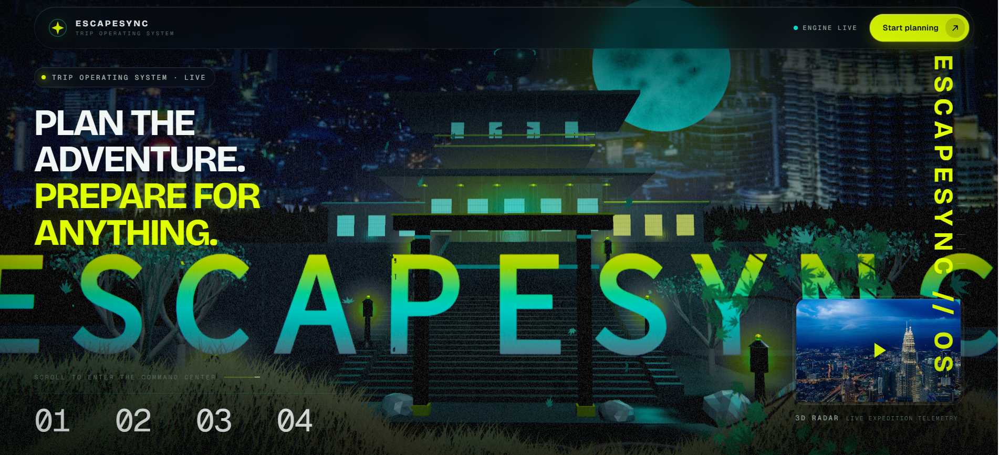
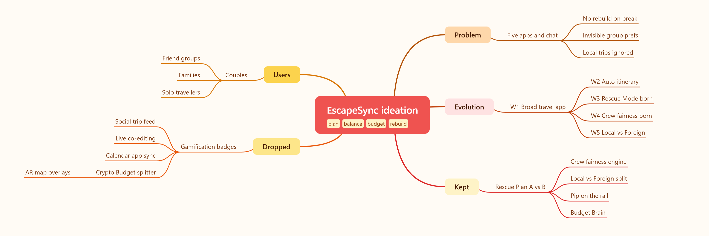
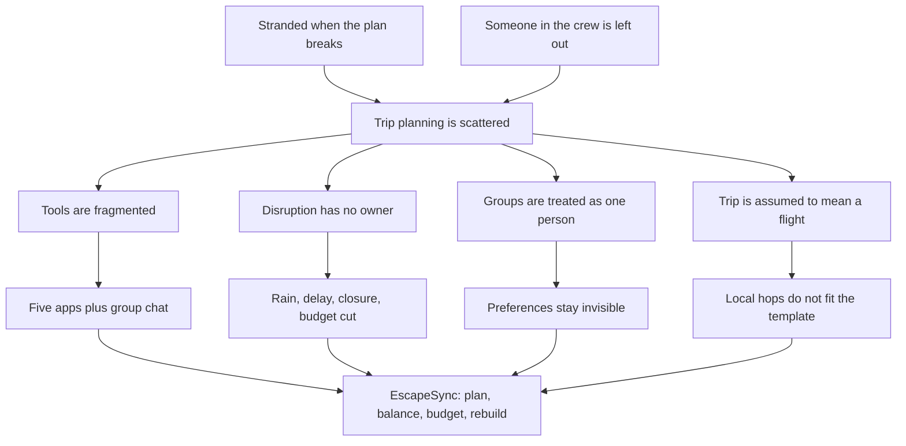
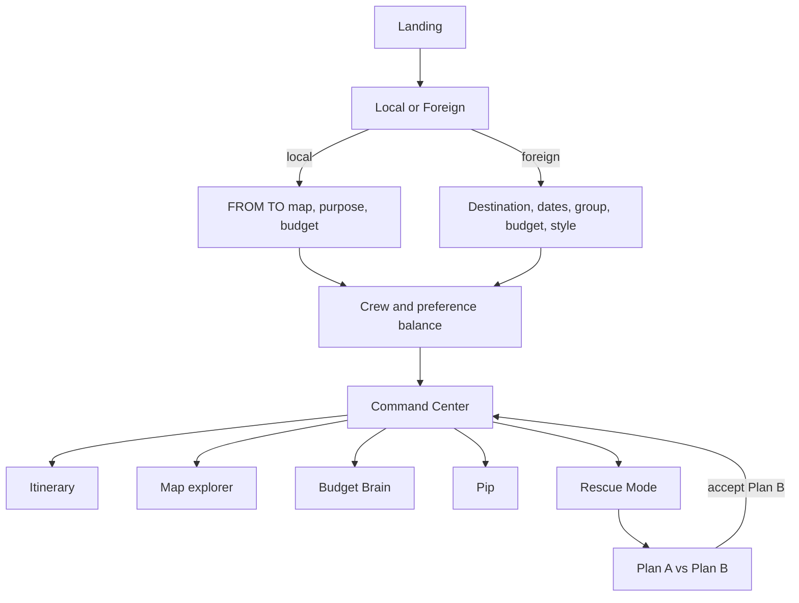
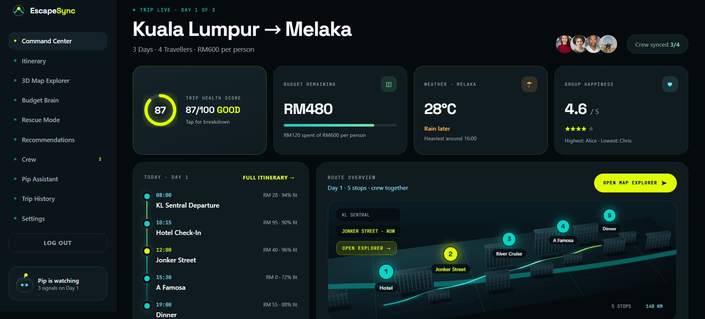
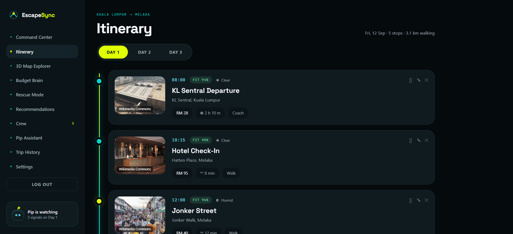
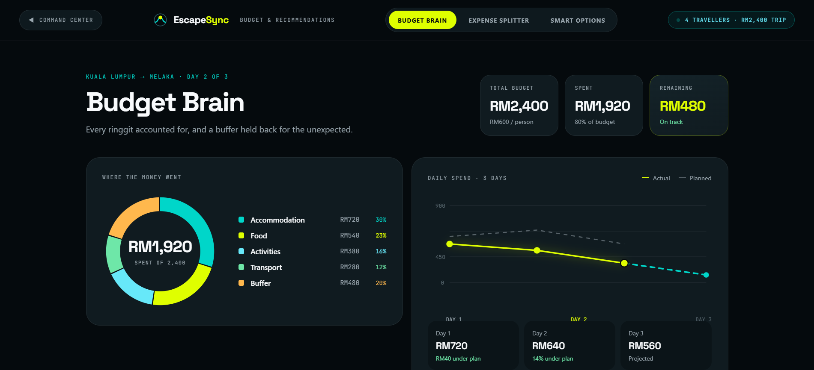
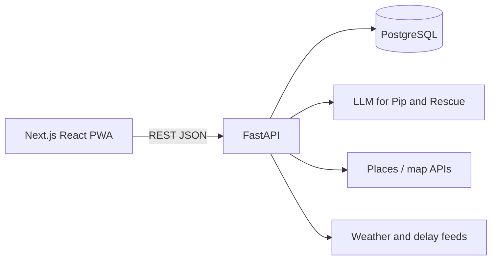

# EscapeSync by Code Benders

**Team:** Code Benders  
**Problem statement:** Travel Planner (Lifestyle: Planning an Escape)
---

**UI prototype**: https://escapesync.vercel.app/  

## 1. Project Overview

### The problem

Group trip planning is fragmented and brittle.

**Causes**

- Flights, stays, spend, activities, and group taste live in different tools, then get glued together in a chat.
- Bookings apps organise what you already bought. They do not rebuild the day when rain, a delay, a closure, or a budget cut hits.
- Groups are treated as one person. Preferences stay invisible until someone is unhappy mid-trip.
- Most products assume “trip = a flight.” Same-city hops (date night, family day out) do not fit.

**Who it is for**

- Primary: groups of 2–6 (couples, friends, families) on a multi-day trip or a same-city outing.
- Secondary: solo travellers who want one command center and a Plan B when something breaks.

**What exists, and why it falls short**

| Product | What it does | Where it fails |
| --- | --- | --- |
| TripIt / Kayak | Import and view bookings | No trip creation, no group fairness, no live replan |
| Google Travel | Flights and hotels | No crew model, no budget tools, no disruption handling |
| Wanderlog / Roadtrippers | Map itineraries | Strong for roads; weak on crew balance, rescue, and local city hops |
| Splitwise | Who owes whom | Spend only — not itinerary, weather, or Plan B |

Travellers still juggle five apps and a group chat. When the plan breaks, they scramble.

### Our solution

EscapeSync is a **group travel operating system**: one place to plan the trip, balance the crew, hold the budget, and rebuild the day when something breaks.

Travellers choose **Local** (same-city FROM → TO) or **Foreign** (overnight), set dates, party shape, and budget, then tune each person’s interests. That becomes a shared itinerary with a live **Command Center**, a map, a **Budget Brain**, and **Pip**, an assistant that watches the day.

When rain, a delay, a closed venue, or a budget cut hits, **Rescue Mode** does not throw the trip away. It protects what still works, finds alternatives, rebalances the group, and offers a Plan B the crew can compare and accept.

The demo trip is **Kuala Lumpur → Melaka** (or a Local hop such as KL → KLCC). The same loop works for solo, couple, friends, or family.

**Feature set (in the prototype)**

- Create trip: Local FROM → TO map **or** Foreign overnight wizard
- Crew preference dials and fairness scores
- Command Center: health, budget remaining, weather, itinerary, map
- Day-by-day itinerary with time, cost, mode, weather, crew fit
- 3D map explorer and Plan A vs Plan B overlay
- Rescue Mode (six disruption types → Plan B → accept)
- Budget Brain, expense splitter, Smart Options with “Why this?”
- Pip (text / voice, preview then apply)
- Share (WhatsApp / email / QR), history, settings

---

## 2. Ideation and process

### 2.1 Ideas we considered

Chosen ideas first. Each row is a distinct direction we generated and weighed — not a rename of the same feature.

| Idea | Why it was kept or dropped |
| --- | --- |
| **Rescue Mode with Plan A vs Plan B compare** (chosen) | **Kept.** Core differentiator. Existing apps organise bookings; they do not rebuild a disrupted day while protecting confirmed stops and remaining budget. The prototype lets the crew compare plans on a map and accept or reject. |
| **Crew fairness engine** (chosen) | **Kept.** Group tools treat the group as a monolith. Per-person dials (food, adventure, culture, nightlife, relaxation, walking, pace, budget) plus fairness scores (demo: Alice 91%, Chris 66%) make under-representation visible before departure. Rescue weights up the person who was left out (Chris → 78% in Plan B). |
| **Local vs Foreign branching** (chosen) | **Kept.** Travel apps assume a destination flight. Same-city outings (KL → KLCC date night) need no hotel, a map FROM → TO, and a purpose (Date / Friends / Family). Splitting the wizard at step 0 avoids a lowest-common-denominator UI. |
| **Pip on the rail, not a hidden chatbot** (chosen) | **Kept.** Travel AI is usually buried in help. Pip sits on Command Center (“Pip is watching”), alerts on weather / budget / delay, and uses preview → apply / discard so the crew stays in control. |
| **Budget Brain + “Why this?” Smart Options** (chosen) | **Kept.** Recs are usually a black box. Each option shows the calculation (budget fit, walking, cuisine, group compatibility). Spend vs plan and a rescue buffer sit in the same surface. |
| Gamification (badges, streaks) | **Dropped.** Distracts from the real failure: planning is scattered and replanning does not exist. Badges do not help when the outdoor market is rained out. |
| Social feed of trip highlights | **Dropped.** EscapeSync is an OS for *this* trip, not a network. Share via WhatsApp / email / QR is enough. A feed needs moderation and a different product. |
| Real-time co-editing (Docs-style) | **Dropped for MVP.** Websockets and conflict resolution are heavy, and not the primary pain. Fairness dials already give each person a voice. Solo-planner-invites-crew is the flow we validated. |
| Calendar sync (Google / Outlook) | **Dropped for MVP.** Useful later, not differentiating now. Rescue and fairness had to be proven first. |
| Crypto / blockchain expense split | **Dropped.** Over-engineered. Who-owes-whom in RM solves the job. Wallets and fees add friction with no user benefit. |
| AR map overlays | **Dropped.** Leaflet + polylines already prove Local FROM → TO. AR needs a native app, camera, and GPS — in conflict with the web-first decision. |

### 2.2 Ideation boards

How the idea actually moved — not a single sketch.

**Mind map — idea space and decisions**



*What this shows:* the problem we started from, week-by-week evolution, what we kept, what we dropped (and why it was a real alternative), and who it is for. Visible connections, not a list in disguise.

**Problem tree — why this product exists**



*What this shows:* we did not start with “a nicer itinerary app.” Effects (stranded crew, someone left out) sit above a root cause (scattered planning). Causes split into tools, disruption, group dynamics, and the flight-shaped template. The solution node is Rescue + fairness + Local/Foreign + budget + Pip.

**User flow — what the idea became**



*What this shows:* both trip types merge into crew fairness, then one live Command Center. Rescue is a loop back into the same trip — not a dead-end settings page.

**How the idea evolved (iterations, including dropped directions)**

| Week | Idea at the time | What we learned | What changed |
| --- | --- | --- | --- |
| 1 | “Travel app for bookings, budgets, and itineraries” | Too broad; overlaps Kayak / TripIt | Discarded “be another booking tab” |
| 2 | “Group travel with auto-generated itineraries” | Better, still no unique angle | Kept group as a constraint; still searching for the twist |
| 3 | “What if the itinerary rebuilt itself when something breaks?” | This is the gap no competitor owns | **Rescue Mode** became the core |
| 4 | “How does the group stay fair during rescue?” | Plan B can still ignore Chris | **Crew fairness engine**; Rescue weights the under-represented person |
| 5 | “What about same-city days?” | Destination-only templates exclude local hops | **Local vs Foreign** split at the start of create-trip |
| Mentor pass | Flutter native app as the plan | Website-first is simpler to ship and judge | Dropped Phase 8 mobile gallery from the *build* plan; web-first PWA instead. AR, crypto split, social feed, and live co-edit stayed dropped. |

### 2.3 Mentor consultation

| Date | Mentor | Feedback received | What was changed |
| --- | --- | --- | --- |
| Prototyping | **Zach Khong** | Build as a **website first** for simplicity; export to mobile later if needed. Original plan was Flutter. | Stack moved to **Next.js + React**, web-first PWA. Prototype already has responsive Local map (Phase 2) and map explorer (Phase 4). Phase 8 (mobile app gallery) was **removed from the build plan**. Native shell (Capacitor / Flutter) is post-traction, not MVP. |

We agreed with the feedback. Web-first removes app-store friction, lets judges open a URL, and matches a three-person build window. We did **not** drop Rescue Mode or fairness to “simplify” — those stay in scope because they are the product. We *did* drop AR navigation, which would have fought the same advice.

---

## 3. Design and prototype

**UI prototype:** [Public link] (must open in an incognito window). Local: `npm install` → `npm run dev` → [http://localhost:3000/](http://localhost:3000/). **Start planning** opens Create Trip. Ordered walkthrough: [`/pages/EscapeSync Phase 9.html`](public/pages/EscapeSync%20Phase%209.html).

Screens below are from the live HTML prototype (Melaka demo data, `localStorage`), not a static mock.

**Landing — enter the product**


*Interaction:* Hero states the job (“Plan the adventure. Prepare for anything.”). **Start planning** opens the Local / Foreign create-trip flow.

**Command Center — the trip, live**



*Interaction:* Day 1 of KL → Melaka. Health 87, budget remaining RM480, rain later in Melaka, group happiness 4.6 with Chris lowest. Today’s rail and a 3D route (5 stops, 148 km). Sidebar to itinerary, map, budget, rescue, Pip. Pip is watching on the rail — disruption is first-class, not a help article.

**Itinerary — stops the crew can trust**



*Interaction:* Day tabs, each stop with photo, time, crew fit %, weather, cost, duration, and mode (coach / walk). Fits and costs are visible before Rescue has to fire.

**Budget Brain — spend, buffer, next decision**



*Interaction:* RM2,400 trip / RM1,920 spent / RM480 remaining (on track). Donut by accommodation, food, activities, transport, **buffer**. Daily actual vs planned. Tabs to expense splitter and Smart Options.

Other clickable surfaces in the same prototype (not pictured): Rescue Mode (six triggers → Plan B compare → accept), crew fairness, Pip preview/apply, share QR `escapesync.app/trip/7F92K`.

---

## 4. What makes it different

Novelty is not “another itinerary.” It is **replanning + group fairness + budget as day-zero features**, plus a Local path that destination apps ignore.

| Twist | Why it is original (or the combination is) |
| --- | --- |
| **Rescue Mode** | Plan B is generated around confirmed stops, remaining budget, and fairness — then compared on the map. Competitors leave you to Google alternatives. |
| **Crew fairness** | The group is not one slider. Under-representation is a number (Chris 66%) and Rescue is told to fix it. |
| **Local vs Foreign** | Same product, two honest wizards. Date-night KL → KLCC is not forced through a flight template. |
| **Pip on the rail** | Watches the day, proposes, previews impact, applies or discards. Not a chatbot in a menu. |
| **Budget Brain + Why this?** | Buffer is a first-class slice of the donut. Recommendations show the maths (budget, walking, cuisine, group fit). |

| | EscapeSync | TripIt / Kayak | Google Travel | Wanderlog / Roadtrippers |
| --- | --- | --- | --- | --- |
| End-to-end plan | Create → crew → itinerary → budget → rescue | Import bookings | View flights / hotels | Map itinerary, no crew sync |
| Group fairness | Per-person dials and scores | No | No | No |
| Live replan | Rescue, Plan A vs B | No | No | Manual reroute only |
| Budget + splitter | Brain, buffer, who-owes-whom | Weak spend | No | Cost estimates, no splitter |
| Local city hop | FROM → TO, purpose, Grab time | Destination only | Destination only | Road trips, not city hops |
| Assistant | Pip preview / apply | No | Search | No |
| Transparent recs | Why this? | No | Generic | Place cards, little reasoning |

---

## 5. Technical architecture and feasibility

### Tech stack

**Prototype (this repo)** — what judges can click today. Not Next.js yet: React/Vite landing + interactive HTML product.

| Layer | Choice | Why | Constraint |
| --- | --- | --- | --- |
| Landing | React 19, Vite 6, Tailwind 4 | Fast to iterate the marketing shell | Frame embeds `kage.html` |
| Product UI | HTML in `public/pages/` + `app.js` | Clickable flows without a backend | Demo copy and Melaka dataset |
| State | `localStorage` (`escapesync.trip.v1`) | Enough to prove the loop | No multi-device sync |
| Maps | Leaflet 1.9.4, OSM tiles | Already in Local FROM → TO and Phase 4 | No live geocoding; small KL lat/lng lookup |
| Backend | None | Prototype is frontend-complete | Persistence and LLM are production work |

**Production (building phase)** — same product, real service.

| Layer | Choice | Why | Constraint |
| --- | --- | --- | --- |
| Frontend | **Next.js + React**, PWA | Mentor: website first. One React model from landing → app. Installable on phones without an app store. | Native Flutter/Capacitor only if traction |
| API | **FastAPI (Python)** | Rescue, fairness, budget, Pip as clear services | Team must keep the API surface small |
| Database | **PostgreSQL** | Trips, members, stops, expenses, rescue events | Scripted Melaka data first — not a generator |
| Hosting | **Vercel** (Next.js) + **Railway / Render** (API + DB) | Matches the web-first plan; free/low tiers for a hackathon | Need env vars and a single demo account |
| AI | LLM **behind FastAPI** | Prototype already splits “Pip proposes / product validates” | Out of MVP if time slips — scripted Rescue still demos the idea |
| Maps | Keep Leaflet | Already proven | Live weather / delay feeds later, not a fifth consumer app |



Tables: `users`, `trips`, `trip_members`, `itinerary_stops`, `expenses`, `recommendations`, `rescue_events`, `alerts`.

### Build plan and scope

We will **not** rebuild all nine prototype phases. MVP is a thin slice that still proves Rescue.

**Must have**

1. Next.js landing (port of the current Vite page)
2. Create Trip wizard — Local (3 steps) and Foreign (5 steps), frontend
3. FastAPI `POST /trips` → PostgreSQL → trip id
4. Schema: `users`, `trips`, `trip_members`, `itinerary_stops`
5. Command Center **read-only** — Melaka itinerary from the DB, health, day cards
6. Rescue Mode **scripted** — one trigger (heavy rain), processing, hardcoded Plan B, accept/reject, persist
7. Responsive web (desktop + mobile in browser; no native app)
8. Deploy: Vercel + Railway/Render

**If time remains:** Budget Brain display, Smart Options “Why this?”, Leaflet on Local create, static Pip chat (no LLM).

**Out of scope for the building phase**

- Real itinerary generation (scripted Melaka only)
- Live LLM for Pip / Rescue
- Live fairness engine (static scores OK)
- Expense-splitter maths
- Weather / delay / places APIs
- Real auth (demo as Alex)
- Native mobile app
- Pip voice, history, settings, Phase 8 gallery

### Time, skills, cost

| | Plan |
| --- | --- |
| People | Three builders in parallel: Next.js UI, FastAPI + Postgres, glue + styling |
| Why it fits | UX is already validated in HTML. We port, we do not redesign. Scripted Rescue is enough to *show* the idea. Schema is small. |
| Cost | Vercel + Railway/Render free/hobby tiers; no paid map or LLM required for MVP |
| Risk we accept | LLM and live weather slip. Rescue still works with one scripted disruption. |
| Risk we refuse | Scope that needs app-store, AR, crypto, or realtime collab |

**Prototype vs next build**

| | Prototype now | Building phase |
| --- | --- | --- |
| Users | Alex + four crew | Same demo sign-in |
| Data | `localStorage` | PostgreSQL |
| Itinerary | Scripted Melaka | Same data, stored as stops |
| Rescue | Six scripted disruptions | One scripted disruption, persisted |
| Pip | Scripted chat / voice | Optional static UI |
| Maps | Leaflet + hardcoded pins | Copy Local map if time |
| Share | Demo WhatsApp / QR | Not required for MVP |

### Run locally

Prerequisites: Node.js.

```bash
npm install
npm run dev
```

Open [http://localhost:3000/](http://localhost:3000/).